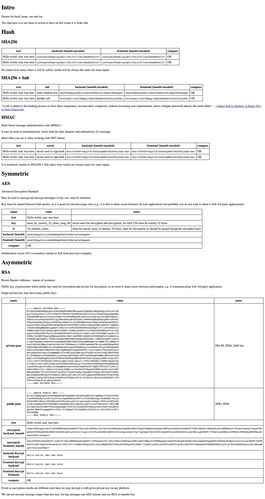

# Cryptography

> There is only two problems in computer science: how to name things and how to invalidate caches

Set of examples of different cryptography algorythms

The goal is to have some samples which may be used to compare results and be sure that choosen algorythm may be used in another language

Also to have some basic feeling and understanding of topic in general

Starting point was:

https://www.youtube.com/watch?v=NuyzuNBFWxQ

## Why

- decade ago we needed encrypt/decrypt things so we did found some working code, copy pasted it, ensured it works and leave as is, later we needed to migrate this part of system to another language and it was like an nightmare for this piece
- when I was trying to communicate with my bank API, I was not sure if I doing things right, and their examples in PHP did not helped me much

## Topics

- hashing
- hmac
- symmetric
- asymmetric

Just go over directories, each has its own readme explaining whats going on

## Demos

Each folder has `demo.sh` with bunch of `docker run ...` commands which may be used to check results

In first demo we should have an overall look and feel over this topics

And in second demo we will have some fun and combine different algorythms to make some crazy things

## Test

Some of the folders may have `test.ps1` PowerShell script to perform a test

## Disclaimer

I'm not an expert in security and/or all of languages used in examples. The purpose was to have working samples and having fun.
